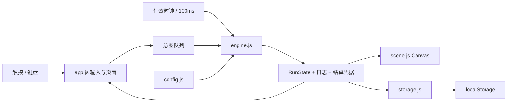
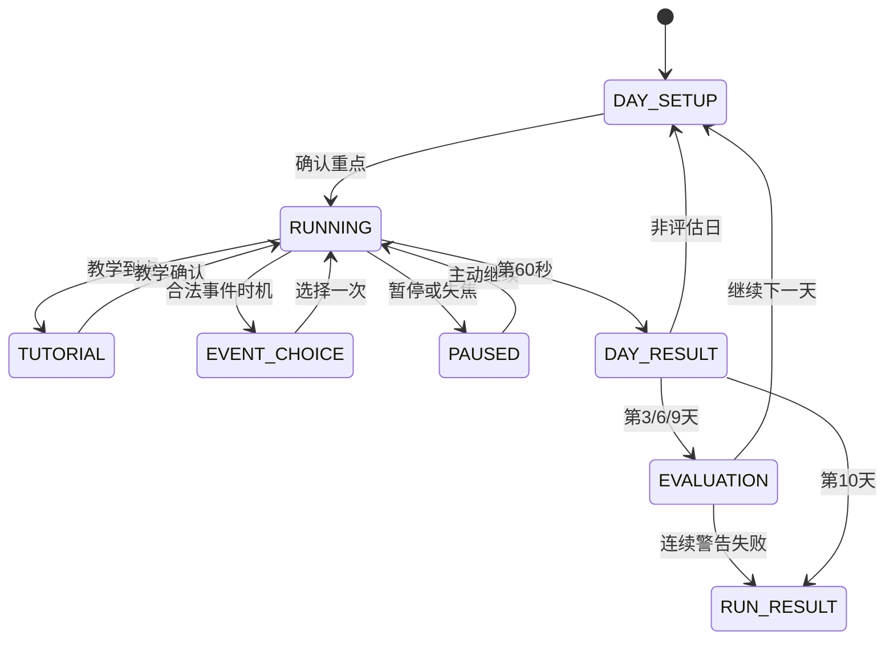

# 首次开发说明

版本：客户端 0.1.0 / 规则 0.2-r1。日期：2026-09-11。本文描述实际工程，不将设计中的全部扩展写成已完成。

## 1. 实现目标与技术选型

本次将策划稿转为可操作、可测试、可继续的竖屏单机 H5 原型。优先验证“工作成长—摸鱼恢复—巡视风险—职级评估”是否形成闭环，再为平台接入提供独立规则模块。

采用原生 JavaScript ES Module、HTML 控件和 Canvas 2D。Node.js 仅用于开发服务器、测试及静态文件构建，浏览器运行时无需 Node。没有 npm 第三方运行依赖，也没有远程字体、图片、登录或云端数据依赖。

选择理由：首版只有一个办公室场景，动作点选而非复杂物理；将规则直接作为 JavaScript 模块便于快速核对数值；HTML 对中文文案、弹窗、键盘和触摸适配更直接。后续如果平台要求专用引擎，可以替换输入与渲染适配层，保留规则用例和配置含义。

## 2. 模块边界

| 文件 | 职责 | 不负责 |
| --- | --- | --- |
| config.js | 规则版本、动作标签、三种重点、六事件、六称号 | 不推进时钟，不持久化 |
| engine.js | 状态创建、动作切换、数值、日程、巡视判定、事件、日末、晋升、结局 | 不访问 DOM、存储或网络 |
| storage.js | 版本/结构/校验码、快照编码、localStorage、称号记录 | 不修改经济规则 |
| scene.js | 像素场景、主角姿态、老板观察、帧表现 | 不产生奖励、随机或游戏时间 |
| app.js | 页面流、按钮意图、主循环、暂停、存档、分享、开发入口 | 不自行实现动作每秒收益 |
| style.css / index.html | 竖屏布局、配色、HTML 按钮及语义 | 不决定达标或惩罚 |

规则函数对传入状态进行受控修改，以减少固定步长中的分配；模块无外部副作用。它不是不可变 reducer，但同一初始状态和输入流有确定性结果。`Date.now()` 只用于新局身份和默认种子，结局写入时间不参与规则判断。

## 3. 页面与动作状态

页面状态包含 `DAY_SETUP / RUNNING / TUTORIAL / EVENT_CHOICE / PAUSED / DAY_RESULT / EVALUATION / RUN_RESULT`。首页、称号、覆盖确认、评估目标和开发台由 UI 的 `screen` 管理，不把页面显示状态混入动作枚举。

暂停还可以保存 `EVENT_CHOICE` 或 `TUTORIAL` 为 `resumePhase`；恢复先回到原弹窗，不跳过未选事件。

动作枚举为 `WORK / PRETEND / IDLE_THINK / IDLE_PHONE / WRAP_UP / APPROVED_REST`。只有前四个动作接受用户请求。动作切换表：

| 来源 | 目标 | 处理 |
| --- | --- | --- |
| WORK / PRETEND | 任一普通动作 | 下一规则边界生效 |
| IDLE_THINK | 不同普通动作 | 进入 WRAP_UP 200ms，保存目标 |
| IDLE_PHONE | 不同普通动作 | 进入 WRAP_UP 1200ms，保存目标 |
| 任一动作 | 同一动作 | 无操作，不重置计时、不发收益 |
| WRAP_UP | 任一普通请求 | 拒绝；暂停仍可用 |
| APPROVED_REST | 任一普通请求 | 拒绝；休息结束自动 WORK |
| 摸鱼 / 收手在观察期间 | 被抓 | 记录当次巡视后强制 WORK，不再收手 |

UI 点击摸鱼方式只负责选择模式；如果已经在摸鱼，会请求切换并经过原模式收手。键盘 4/5 直接请求对应动作。

## 4. 时钟与同刻处理

`requestAnimationFrame` 只提供墙钟间隔，累积满 100ms 才调用一次 `tick`。多帧可以对应一个规则步，一帧也可以补多个规则步。暂停、弹窗、后台或失焦不增加累积时间；恢复重新设置帧基准，清空不足一步的余额。

每次规则步依次：

1. 读取步初精力、正在观察的巡视与动作。
2. 计算上一段 100ms 的收益、低精力累计、巡视工作/装忙累计。
3. 检查装忙识破风险，更新时间；先结算已结束巡视。
4. 完成收手或获准休息，转入目标动作。
5. 若已到 60 秒，清输入，进行日末事务，不再弹新事件。
6. 处理当前边界的动作队列，已经观察的老板立即检查。
7. 检查新预警和新观察，观察开始立即检查当前动作。
8. 检查教学和事件弹窗。

输入统一量化到下一规则步，重复点击只请求动作，不自行产生收益。所有有经济意义的浮点结果保留到小数点后 6 位，避免类似 29.999999999 的累计误差改变门槛；界面显示值不用于规则比较。

观察区间为 `[start, end)`。收手在观察开始同刻完成可安全；已经处于观察中的收手仍被抓。假装很忙在同次观察累计 2 秒后开始有概率被看穿，累计 4 秒稳定识破；识破和巡视结束同刻时先识破再结算，因此不能在最后一步逃过处罚。

前台卡顿按规则步追赶，最多单帧处理 600 步，正好覆盖一个工作日；一旦遇到事件/教学/日末就停止，等待玩家。后台不追赶。

## 5. 属性与计算

初值：精力 80、经验 0、好感 50、快乐 0、职级 1、警告 0。精力/好感/快乐限制 0–100；经验非负；技能 `min(10, 1 + floor(xp/40))`。

工作效率按步初精力决定：≥30 为 1，0<精力<30 为 0.5，0 为 0。效率只影响经验与进度，精力消耗不打折。

| 工作重点 | 经验/秒 | 进度/秒 | 精力消耗/秒 | 基础目标 | 达标 / 失败好感 |
| --- | ---: | ---: | ---: | ---: | --- |
| 日常 | 1 | 1 | 1.5 | 24 | +3 / -4 |
| 学习 | 1.4 | 0.6 | 1.5 | 14 | +1 / -2 |
| 紧急 | 0.8 | 1.2 | 1.95 | 28 | +7 / -6 |

配置已保存最终速率，因此不再乘 1.5 或 1.3。目标 `基础目标 + (日初职级-1)×3 + 事件加量`。保存 `dayRank`，防止日末晋升后让当日目标变动。

低精力包含零精力工作；累计每 10 秒进度 -3、好感 -2，进度最低 0。切换或恢复精力只暂停累计，第二天才清零。

发呆每秒精力 +2、快乐 +0.4；手机 +3、+0.7。仅当没有老板观察且至少一项实际增长时累计成功摸鱼时长。假装很忙每秒精力 -0.2，不成长、不恢复；老板观察中存在识破风险。

## 6. 巡视日程

使用局内 LCG 状态生成随机数：`state = (1664525 × state + 1013904223) mod 2^32`。它用于可重放和测试，不用于密码学。种子及中间随机状态随存档保存。

初级每天 3 次观察各 5 秒，熟练 2 次各 6 秒，负责人 1 次 7 秒。普通锚点采用策划值并加入 -2 到 +2 秒、100ms 格点偏移。尝试最多 20 次；不合法使用原锚点。

普通预警提前 2.5 秒。日程检查预警不早于第 8 秒、结束不晚于 60 秒、预警开始间距 ≥8 秒、预警与观察不重叠。每日 20% 尝试假脚步；每次基础巡视结束 20% 尝试折返，每日最多一次。折返生成时即改变 revision 并保存，不在读档时重抽。

首局教学第一天固定 14.5、31、47 秒开始观察，关闭假脚步与折返。

提醒券将尚未公布且可合法提前的真实预警改为提前 4 秒，并在预警开始消耗。已有预警不变，假脚步不消费。**当前实现遇到间距冲突会顺延使用券，属于与“下一次真实巡视”字面的已知差异；需在下一版统一日程预留策略。**

每次巡视存储 `workMs / pretendMs / caught / exposed / penaltyApplied / settled`。处罚按巡视唯一标志控制：被抓 -12好感/-5快乐；识破 -5好感；先发生者只罚一笔。先识破后摸鱼仍计一次 caught 并转工作。无违规时真实工作≥3秒 +4，否则假装很忙≥1且未被识破 +1。

## 7. 事件与教学

普通事件每天最多一次，不连续两天重复；第 1 天无普通事件。日初优先 E05（第4/7天、技能够而好感不够、非最高职级），其次 E06（第5/10天，40秒预留），其余从合格 E01–E04 抽取。

普通事件第15秒尝试，预警/观察/收手期间延后；普通上限45秒，E02为30秒之前，E03为40秒之前，E06为50秒之前。事件到上限取消，不补位。

事件展示时不扣成本；选择时检查 phase、eventId、eventStatus、选项和精力。成功后立即标记 used，双击失效。事件加量写入 modifiers，日末与基础目标统一验收。合法休息照常经过游戏时间、不被抓、不算成功摸鱼或工作认可。

教学先展示欢迎和操作说明；工作5秒暂停引导发呆，发呆3秒暂停介绍手机。第12秒预警保持运行。跳过后保留当前属性但取消保护；首局第一场巡视被抓只扣4好感且不扣快乐。完成/跳过标记与正式存档一起保存，后续正式新局不重复教学。

## 8. 日末事务、晋升与结局

`settleDay` 首先检查本日凭据是否已存在。只第一次执行以下步骤：

1. 用最终进度比较最终任务目标。
2. 汇总基础任务和所有已接受事件的成功/失败好感，合计后限制0–100。
3. 第3/6/9天评估：先低好感风险，再晋升，再维持；最多一级。
4. 保存恢复前精力、经验增量、奖惩、assessment，写入 dailyResults。
5. 失败或第10天冻结 RunResult。非失败恢复精力30；最终幸福感仍使用恢复前值。
6. 生成唯一 `runId:day:dayNumber` 凭据，进入日末页，UI保存完整快照。

日末按钮 `acknowledge` 只切页面和天数，不发放奖励。第10天不评估，不会创建第11天。

幸福感：`round(joy×0.7 + beforeRestEnergy×0.3)`。称号按策划 END01–END06 判定，可同时解锁，用户选择展示哪个。

本版另提供0–100的职场成绩：`round((rank-1)×25 + skill×3 + favor×0.2)`。**这是原型补充公式，不是原策划的既定数值，后续由策划确认。** 最佳记录按完整正式局该成绩最大值更新，同分保留先前记录。

## 9. 存档协议与异常

局内键为 `office-slack.run.v1`；个人档案为 `office-slack.profile.v1`。局内外分别写入，演示局不写二者。

局内存档封装 `{checksum, payload}`，payload是完整JSON字符串；校验码为32位FNV风格校验，用于发现截断或意外修改，不用于防作弊。解码检查schema、配置版本、必要字段、状态枚举、数值范围、巡视数据及结算凭据；不兼容时提示重新开始，原始值保持不变并允许导出。

`localStorage.setItem` 单键写入作为原子提交。局内存档和个人记录不是跨键事务，因此在读取结局继续保存时重新按 runId 幂等写记录。每日结算本身保存在局内原子快照中。

保存时机：新局、重点确认、事件选择、教学确认、结算确认、暂停/返回首页、失焦/后台、规则重要日志改变，以及运行中每2秒。强制关闭最多可能回退最近2秒；系统强杀没有回调时依赖周期快照。

加载运行中存档显示暂停，必须主动继续，不补离线收益。未选事件和剩余休息/收手均保留。存储不可用时显示错误横幅，允许继续和导出，不假装保存成功。

记录最近100局，并维护已解锁称号和个人最佳。清理站点数据会清空本地档案。尚未做云存档、账号、多标签页写入冲突仲裁或存档导入界面。

## 10. 画面、输入和可访问性

场景内部分辨率240×224，按像素缩放，包含窗外、墙面、同事、巡视入口、老板、主角、前景桌面和植物。主角动作通过键盘/文件/手机/发呆/杯子表现，收手动画随剩余时间变化。程序美术可逐层替换为正式图集，不必改规则。

采用既定深蓝灰、奶油、暖木、蓝色工作、暖黄色摸鱼、淡紫装忙。顶部四属性常驻，任务和剩余时间由真实状态读取。预警独立于反馈气泡，不能被事件闲聊覆盖。

按钮为原生button，最小44px；有可见焦点、动作选中态、文字状态、对话框焦点控制、Esc路径与aria标签。Canvas信息另由HTML状态说明，尽量不把关键规则仅画在像素里。`prefers-reduced-motion` 关闭人物待机运动。当前只设计一套固定明亮面板主题，没有宣称支持独立暗色皮肤。

375/390竖屏为主要体验，320极小屏和横屏允许纵向滚动，不强制隐藏内容。实际手机浏览器地址栏、安全区和系统字体放大仍需真机验证。

## 11. 调试、扩展与安全边界

`?debug=1` 开启演示台和 `window.officeDebug`。可以加载安全/被抓/晋升/结局快照或完整练习。界面支持固定种子、指定天数/精力/经验/好感、模拟日末、导出完整状态和日志。调试结果的demo标记随结局显示，分享文本也带演示数据。

浏览器客户端可被用户修改，不提供防作弊保障。不要直接据此建立联网排行或奖励系统。日志只存本机，未默认上传用户数据。

新增事件：在config增加稳定ID和明确选项成本；补事件资格/时机；在chooseOption添加幂等效果；为延期、成本不足、双击和跨日结算补测试。新增平衡参数：改唯一权威值并升级VERSION；不要同时保留倍率和最终速率两套计算。

接平台时先封装生命周期、存档、音频和分享适配器；规则引擎不直接依赖平台对象。平台接口必须按接入时官方资料验证，不预写未确认API。
